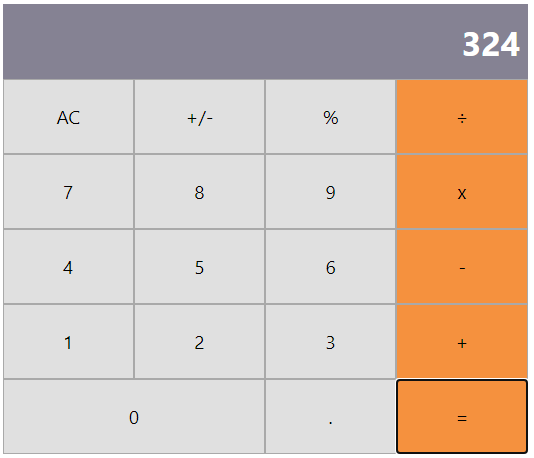

In this project:
- I Used React to build a calculator app.

This project was bootstrapped with [Create React App](https://github.com/facebook/create-react-app).

## What it does
- When the app is opened, you can make calculations, such as: sum, substraction, multiplication and division.

## ScreenShot

## Live Demo
[Calculator Link](https://sello-calculate.herokuapp.com/)

## Built with
- React
- HTML
- SCSS

### Prerequisites

- Node
- Npm

### Setup

- git clone `https://github.com/taiwocoker/React-Calculator.git`
- cd calculator
- run npm install
- run npm run start

## Author

👤 **Taiwo Coker**

- Github: [@githubhandle](https://github.com/taiwocoker)
- Twitter: [@twitterhandle](https://twitter.com/SelloCoker)
- Linkedin: [linkedin](https://linkedin.com/in/taiwo-coker)

## 🤝 Contributing

Contributions, issues and feature requests are welcome!

Feel free to check the [issues page](https://github.com/taiwocoker/React-Calculator/issues).

## Show your support

Give a ⭐️ if you like this project!## Live 